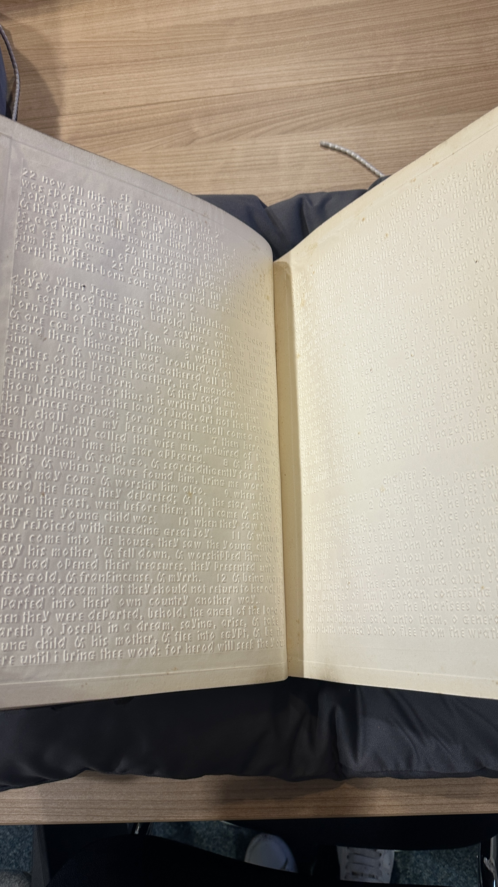
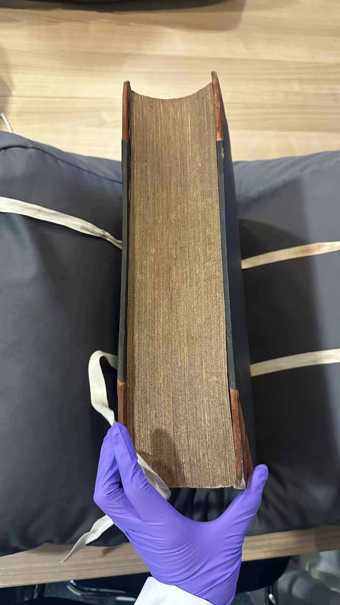

# An Embossed New Testament for Blind Readers (1850)
## Project overview
This project explores a nineteenth-century embossed New Testament produced for blind readers, held in the University of Glasgow Special Collections (Sp Coll RF 256). Printed in 1850, the book uses raised Roman letters rather than Braille, allowing readers to identify words by feeling the shapes of individual letters.
The project uses this object to think about early forms of accessibility and to question what happens when tactile reading experiences are digitised. While digital technologies and AI are effective at reproducing text and images, they struggle to represent touch. This project examines that limitation directly.
## The object
The object is an English New Testament (Authorized Version), printed in New York in 1850 by the American Bible Society. It consists of two volumes and was printed in high relief specifically for use by blind readers.
Produced before Braille became widely adopted, the book represents an alternative tactile reading system in which readers traced the shapes of raised Roman letters with their fingers. Reading in this way would have been slow, physical, and highly dependent on touch.

*Figure 1. Close-up detail of raised Roman letters embossed into the page. The text was designed to be read through touch rather than sight.*

*Figure 2. An open double-page spread showing wide spacing and uniform letter height, supporting slow and deliberate tactile reading.*

*Figure 3. The thickness of the volume and exposed page edges emphasise the physical weight and material presence of the book.*
## Why this object matters
Although the physical form and purpose of the book are documented, little is known about how blind readers actually experienced reading it. This lack of experiential documentation makes the object especially difficult to digitise. Photographs and scans can show the raised letters, but they cannot convey the sensation of touch or the embodied effort involved in tactile reading.
This object therefore raises broader questions about digitisation, accessibility, and loss: what aspects of historical reading practices can be preserved digitally, and what aspects resist capture?
## Method and use of AI
AI is used in this project as a tool for interpretation and communication rather than reconstruction. Text-based and visual AI tools are explored to help translate the object’s significance for a contemporary audience through formats such as README documentation, postcards, and short videos.
Rather than attempting to recreate tactile experience, the project uses AI to highlight its absence. By working through digital representations, the project draws attention to what is lost when touch-based objects are transformed into visual and textual data.
## Ongoing exploration
The project also speculates on contemporary approaches to tactile representation, including raised-dot systems and 3D-printed relief surfaces. These ideas are explored conceptually to reflect on modern assumptions about accessibility and technological solutionism, rather than as fully functional replacements for historical tactile reading.
